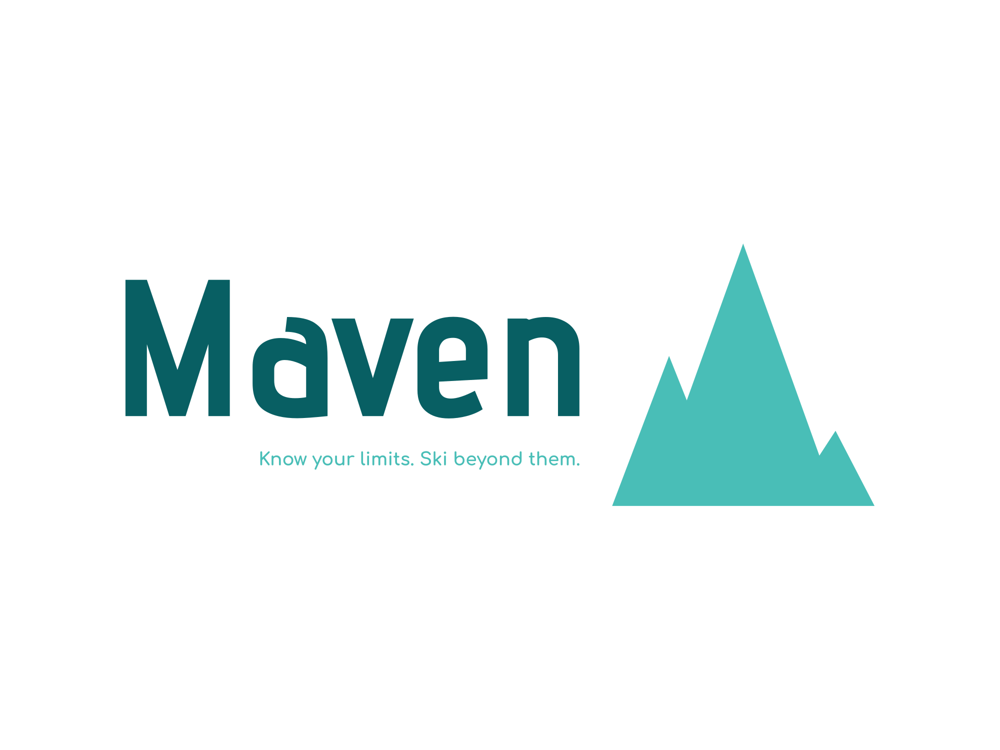

# Maven Ecommerce Project

Welcome to the Maven Ecommerce Project repository, a comprehensive ecommerce website development initiative for a fictional ski goods retailer!



## Deployment

- **Website URL:** [Maven.com](https://220253804.cs2410-web01pvm.aston.ac.uk/Ecom-Maven-main/public/)

## Admin Dashboard

- **Admin Dashboard URL:** [Maven.com/admin](https://220253804.cs2410-web01pvm.aston.ac.uk/Ecom-Maven-main/public/redirect)

## Login Credentials

- **Admin Login:**
  - Email: admin@mavenecommerce.com
  - Password: SecureAdminPassword123!

- **Sample User Login:**
  - Email: user@example.com
  - Password: SampleUserPassword!

## Table of Contents
- [Overview](#project-overview)
- [Tech Stack](#technology-stack)
- [Project Management](#project-management)
- [Getting Started](#getting-started)
  - [Installation](#installation)
- [SQLite Setup](#setting-up-sqlite-command-line-tool-on-windows)
- [Running Tests](#running-tests)
  - [Running all tests](#running-all-tests)
  - [Running Unit Tests](#running-unit-tests)
  - [Running Integration Tests](#running-integration-tests)

## Project Overview

- **Objective:** Develop a user-friendly platform for online purchase of ski equipment and related products.
- **Business Domain:** Focused on the ski industry, catering to both casual and avid skiers.
- **Scope:** Fully functional ecommerce website with features like user account management, product browsing, secure checkout, and order tracking.
- **Target Audience:** Skiing enthusiasts of all levels.

## Technology Stack

- **Backend Framework:** Laravel
- **Version Control:** Git
- **Task Tracking Tool:** Trello <!-- (Board Link: Trello Board) -->

## Project Management

- **Software Engineering Process:** Agile methodology.
- **Task and Project Tracking:** Trello for comprehensive task management and progress tracking.

## Getting Started

### Installation

1. Clone the repo
   ```sh
   git clone https://github.com/EddiePoulter/Ecom-Maven.git
   ```
2. Install Composer packages and enable the required extensions within the php folder i.e. sqlite
   ```sh
   composer install
   ```
3. Copy the environment file & edit it accordingly
   ```sh
   cp .env.example .env
   ```
4. Ensure that the `DB_CONNECTION` in your `.env` file is set to `sqlite`.
   
   Create an empty database file. You can do this manually or by running:
   ```sh
   type nul > database\database.sqlite
   ```
5. Generate application key
   ```sh
   php artisan key:generate
   ```
6. Create Database then migrate and seed
   ```sh
   php artisan migrate --seed
   ```
7. Linking Storage folder to public
   ```sh
   php artisan storage:link
   ```
8. Serve the application
   ```sh
   php artisan serve
   ```
Production server is making usage of MySQL however as tested SQLlite is much more efficient for local systems.

### Setting Up SQLite Command-Line Tool on Windows

To view and interact with the SQLite database tables directly from the command line, follow these steps to set up the SQLite command-line tool on Windows:

1. **Download SQLite:**
   - Go to the official SQLite website: [SQLite Downloads](https://www.sqlite.org/download.html)
   - Download the latest bundle for Windows.

2. **Extract and Add to PATH:**
   - Extract the downloaded ZIP to `C:\sqlite`.
   - Add `C:\sqlite` to the system PATH.

3. **Open PowerShell:**
   - Open a new PowerShell window.

4. **Navigate to your project directory.**

5. **Open SQLite Prompt:**
   - Run `sqlite3 database.sqlite`.

6. **Execute Commands:**
   - Use SQLite commands (`sqlite>`).

7. **Exit:**
   - To exit, run `.exit`.

Remember, you can also run `sqlite3.exe` directly if needed.

## Running Tests

Laravel is built with testing in mind. In fact, support for testing with PHPUnit is included out of the box, and a `phpunit.xml` file is already set up for your application.

### Running all tests

You may run all of the tests for your application using the `test` Artisan command.

```sh
php artisan test
```

### Running Unit Tests

Unit tests are typically run in isolation from your application and its dependencies. When running unit tests, Laravel won’t load your database or other services. Here’s how you can run them:

```sh
php artisan test --filter Unit
```

### Running Integration Tests

Integration tests provide a way to test your application’s “integration” with its environment and third-party services. Here’s how you can run them:

```sh
php artisan test --filter Integration
```

Remember to replace `Unit` and `Integration` with the actual names of your test classes.

For more information, please refer to the Laravel testing documentation.
