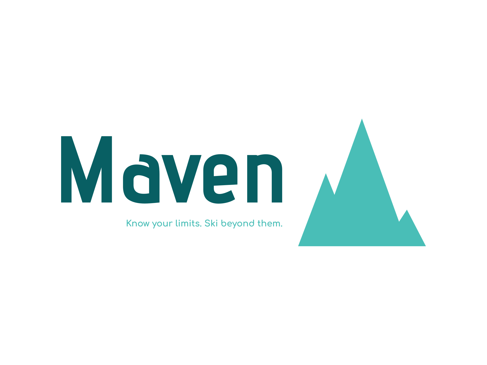

# Maven Ecommerce Project

Welcome to the Maven Ecommerce Project repository! This project aims to develop a comprehensive ecommerce website for a fictional ski goods retailer.

## Project Overview

- **Objective:** Develop a user-friendly platform for online purchase of ski equipment and related products.
- **Business Domain:** Focused on the ski industry, catering to both casual and avid skiers.
- **Scope:** Fully functional ecommerce website with features like user account management, product browsing, secure checkout, and order tracking.
- **Target Audience:** Skiing enthusiasts of all levels.

## Technology Stack

- **Backend Framework:** Laravel
- **Version Control:** Git
- **Task Tracking Tool:** Trello <!-- (Board Link: [Trello Board](https://trello.com/invite/b/FMaPXgFd/ATTI66eb2bc0521d974355c579e818f28fd42454FB6C/e-commerce-maven-team-14)) -->

## Project Management

- **Software Engineering Process:** Agile methodology.
- **Task and Project Tracking:** Trello for comprehensive task management and progress tracking.

<!-- ## Getting Started

To get started with the Maven Ecommerce Project, follow these steps:

1. Clone the repository: `git clone [repository_link]`
2. Install dependencies: `[instructions if any]`
3. Run the project: `[instructions if any]`

Feel free to explore our Trello Board for detailed task breakdowns and ongoing progress. 

## Contributing

We welcome contributions! If you would like to contribute to the project, please follow our [Contribution Guidelines](CONTRIBUTING.md).

## License

This project is licensed under the [License Name] - see the [LICENSE.md](LICENSE.md) file for details. -->

Happy coding!
